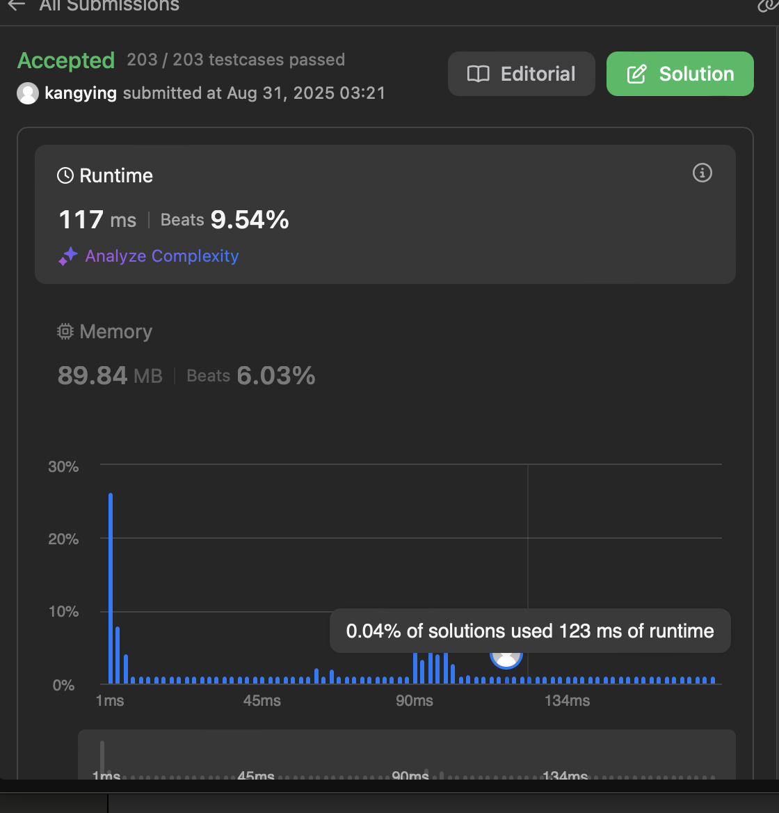

# Kosaraju's Algorithm: Interactive Visualization

An interactive and visually engaging web-based visualization of **Kosaraju's Algorithm** for finding **Strongly Connected Components (SCCs)** in a directed graph.  

Built with **D3.js**, this project goes beyond a plain algorithm demo — it presents a **narrative journey** of uncovering hidden communities inside complex networks, helping users understand not just *how* the algorithm works, but also *why*.  

---

## 📖 Story & Concept

Graphs often look like chaotic webs of nodes and edges. But hidden within them are **communities** — tightly knit groups of nodes where everyone is mutually reachable. These are the **Strongly Connected Components (SCCs)**.  

Kosaraju’s Algorithm is a two-pass DFS-based method that isolates these communities. This visualization illustrates the process step by step:  

1. **The Tangled Web**  
   - Initially, the graph appears as one large, intertwined network.  
   - Directed edges that connect different communities (one-way "bridges") are highlighted in **orange**.  
   - These bridges form a **DAG of SCCs**.  

2. **The Reversal — Broken Bridges**  
   - In Phase 2, all edges are reversed.  
   - The one-way bridges flip direction and **lose their connecting power**.  
   - Visually, they fade or “break,” isolating the communities into distinct islands.  

3. **The Discovery — Finding SCCs**  
   - In Phase 3, nodes are processed in finish-order from the first DFS.  
   - Each DFS traversal is now **trapped inside one community** (since bridges are broken).  
   - Identified SCCs are highlighted with unique colors and pulled apart into **clusters** in a force-directed layout.  

✨ The chaotic mess transforms into clear, distinct groups — bringing the algorithm’s logic to life.  

---

## ✨ Features

- **Interactive Force-Directed Graph**  
  Explore the network with pan & zoom, powered by D3.js.  

- **Algorithm-Aware Graph Generation**  
  Graphs are generated as a **DAG of SCCs** so that the “bridge-breaking” effect is visually striking.  

- **Step-by-Step Animated Phases**  
  - **Phase 1 (First DFS):** Nodes change color when visited and finished, while finish order is pushed onto a visual stack.  
  - **Phase 2 (Graph Reversal):** Edges animate as they reverse; bridges fade to emphasize their loss of connectivity.  
  - **Phase 3 (Second DFS & Clustering):** SCCs are discovered, uniquely colored, and pulled into separate clusters.  

- **Status Panel with Explanations**  
  A plain-English commentary explains what the algorithm is doing and why, as each step unfolds.  

- **Modern Dark-Themed UI**  
  Clean and accessible design that highlights the algorithm’s flow.  

---

## 🚀 Getting Started

This is a **self-contained HTML file** with no build process required.  

1. **Download the File**  
   Save the provided HTML code as `index.html`.  

2. **Open in a Browser**  
   Double-click `index.html` in any modern browser (Chrome, Firefox, Edge).  

✅ That’s it — no server setup or additional dependencies required.  

---

## 🛠️ Technologies

- **HTML5**  
- **CSS3**  
- **JavaScript (ES6+)**  
- **D3.js (v7)** — Core library for visualization and DOM manipulation  

---

## 📌 Future Improvements (Ideas)

- Add controls to pause, step forward/backward through phases.  
- Export discovered SCCs as JSON/CSV for further analysis.  
- Add option to generate random graphs or user-defined inputs.  

